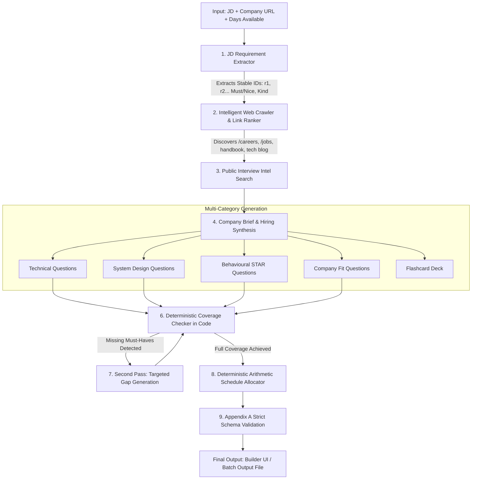

# PrepKit.AI — Autonomous Interview Preparation Kit Generator

> **TRAO Engineering Assessment (`FS-AI-INTERVIEW-01`)**  
> *Autonomous multi-pass company retrieval, deterministic requirement coverage, arithmetic study scheduling, and interactive practice environment.*

---

## 1. Project Overview & Tech Stack

**PrepKit.AI** transforms any job description, company website, and target interview timeline into a comprehensive, personalized interview preparation kit conforming strictly to the TRAO Appendix A schema.

### Tech Stack & Rationale
* **Frontend**: Next.js 14 (App Router) + Tailwind CSS + Lucide Icons
  * *Rationale*: Instant server-side rendering, type-safe API routing, streaming SSE support for live pipeline visualization, and responsive glassmorphic design.
* **Backend**: Node.js + Next.js API Routes (with isolated execution pipeline)
  * *Rationale*: Unified TypeScript types across crawler, generation pipeline, and UI; zero boundary impedance.
* **LLM Provider**: OpenAI (`gpt-4o-mini` / `gpt-4o`) with native fallback support for Google Gemini (`gemini-1.5-flash` / `gemini-2.0-flash`) and Groq (`llama-3.1-8b-instant`).
  * *Rationale*: High token throughput, sub-second latency, structured JSON mode, and robust rate-limit resilience.
* **Database & Persistence**: Local in-memory/file-backed JSON store with optional MongoDB adapter.
  * *Rationale*: Guarantees zero-config setup on clean clones while providing scalable document persistence.
* **Scraping & Retrieval**: Axios + Cheerio + heuristic DOM stripping + SSRF safety guards.
* **Testing**: Vitest (13 automated unit & integration tests).

---

## 2. Setup & Installation

### Local Installation
```bash
# 1. Clone repository and navigate to directory
git clone <repo-url>
cd Interview-prep-assign

# 2. Install dependencies
npm install

# 3. Configure environment variables
cp .env.example .env
# Open .env and add your OPENAI_API_KEY (or GEMINI_API_KEY / GROQ_API_KEY)
```

### Running the Development Server
```bash
npm run dev
```
Open [http://localhost:3000](http://localhost:3000) in your browser.

---

## 3. Mandatory Batch Entry Point (Section 9)

Run the autonomous evaluation pipeline over any batch cases JSON file without launching the web server:

```bash
npm run evaluate -- --input <path-to-cases.json> --output <path-to-output.json>
```

### Example:
```bash
npm run evaluate -- --input examples/sample_cases.json --output kits.json
```

### Key Batch Features:
* **Conformity**: Writes output strictly matching Appendix B (`{ "version": "1.0", "generated_at": "...", "kits": [...] }`).
* **Fault Isolation**: If an individual case fails (e.g., malformed URL), the pipeline records `status: "failed"` with an error code and continues the remaining cases.
* **Localhost Support**: Fully supports locally served test sites (e.g., `http://localhost:8099/acme/`) by following relative links and honoring local hosts.
* **Performance**: Completes 5 cases in under 15 minutes with token-bucket rate limiting.

---

## 4. Architecture & Pipeline Sequencing



### Why Sequencing Matters:
1. **Pasted JD First**: Requirements and seniority are extracted immediately without external network dependencies.
2. **Dynamic Link Discovery**: Instead of hard-coding `/careers`, the crawler parses homepage links and scores them based on hiring keywords (`careers`, `jobs`, `hiring`, `handbook`, `engineering-blog`, `team`, `values`).
3. **Isolated Prompting**: Technical questions and behavioral questions are generated in separate LLM calls with distinct prompts (a 5-year React requirement receives architecture/performance questions, while mentorship receives STAR-structured behavioral prompts).
4. **Deterministic Coverage Loop**: Coverage checking is computed by pure TypeScript algorithms, NOT by asking the model.
5. **Deterministic Scheduling**: Day distribution and integer minute calculations are computed arithmetically.

---

## 5. Coverage Checking & Multi-Pass Loop (Section 4)

* **Pass 1**: The system compares generated question `requirement_ids` against extracted requirements.
* **Gap Detection**: Any requirement (especially `priority: "must"`) with 0 mapped questions is isolated.
* **Pass 2 (Targeted Loop)**: The orchestrator triggers category-specific prompts focusing exclusively on the uncovered requirements, merging them into the question bank with incremented IDs.
* **Deterministic Fallback**: If an item remains uncovered after the loop, the engine deterministically generates a direct competency question so no kit ever ships with missing must-have requirements.

---

## 6. Deterministic Schedule Allocation (Section 8)

The schedule allocator allocates material strictly across `days_available` days using mathematical binning:
* **Difficulty & Priority Weighting**:
  * Questions covering `must` requirements and high difficulty (`difficulty: 3`, system design, core technical) are placed in early days (Day 1 to $\lfloor N/2 \rfloor$).
  * Behavioral STAR stories and deep-dive scenarios occupy mid days.
  * Company culture, domain fit, and final simulation occupy the final days.
* **Integer Minute Calculation**:
  $$\text{Minutes} = 15\text{m (baseline review)} + \sum (\text{Diff 3} \times 25\text{m} + \text{Diff 2} \times 15\text{m} + \text{Diff 1} \times 10\text{m})$$
  Minutes are rounded to positive integers.
* **Referential Integrity**: Every `question_ids` entry in `schedule.days` references a valid question in `kit.questions`.

---

## 7. State Management & Section Regeneration (Section 6)

One of the central challenges of the assessment is allowing individual section regeneration without clobbering user edits:

### How State is Represented:
Every Question and Flashcard maintains:
* `origin`: `"generated" | "edited" | "manual"`
* `pinned`: `boolean`

### Regeneration Invariant:
When `/api/kits/[id]/regenerate-section` is triggered:
1. **Target: Category** (e.g. `technical`):
   * Questions where `origin === 'edited'`, `origin === 'manual'`, or `pinned === true` are **preserved intact**.
   * Only unpinned `"generated"` questions in that category are replaced with fresh prompts.
   * Coverage and Schedule are re-synchronized automatically.
2. **Target: Company Brief**: Re-crawls and synthesizes the company summary while leaving all questions, flashcards, and schedules untouched.
3. **Target: Schedule**: Re-bins current questions across the user's selected days while preserving custom question edits.

---

## 8. Practice Mode & Spaced Repetition (Section 7)

* **Active Recall**: 3D flip card viewer revealing answer outlines on click or `Spacebar`.
* **Confidence Rating**: Users rate recall using 4 levels:
  * 🔴 **Again (1)**: Immediate reset
  * 🟠 **Hard (2)**: Struggled
  * 🟡 **Good (3)**: Recalled with effort
  * 🟢 **Easy (4)**: Instant mastery
* **Adaptive Ordering**: Subsequent sessions automatically prioritize cards with the lowest historical confidence scores.

---

## 9. Creative Feature: AI Bar Raiser Mock Interviewer

To address the real-world anxiety of live interview pushback, we built the **AI Bar Raiser Mock Interviewer**:
* Candidates choose any question from their kit and type (or dictate) their response.
* The Bar Raiser assesses:
  1. **Score (1–10)** and **Verdict** (`Strong Hire`, `Hire`, `Leaning Hire`, `Needs Improvement`).
  2. **Strengths Hit**: Specific concepts explained well.
  3. **Weaknesses & Missing Concepts**: Technical edge cases or STAR components missed.
  4. **Exemplary Staff Engineer Model Answer**: Illustrates what a top 1% response looks like.
  5. **Probing Follow-Up Question**: Simulates realistic conversational pushback from a senior hiring manager.

---

## 10. Edge Cases & Resilience

| Edge Case | Handling Strategy |
| :--- | :--- |
| **Thin 2-line JD stub** | Extractor flags `isStub`, extracts only genuine requirements, and refuses to hallucinate unstated skills. |
| **Company 404 / Unreachable** | Crawler records non-fatal failure; kit proceeds with honest notice in `company_brief`. |
| **No Hiring Page on Site** | Company brief honestly states no public hiring roadmap was found; creates standard round guidance. |
| **1-Day or 60-Day Schedule** | Allocator bounds days between 1 and 60. Day 1 packs an intensive crash review; Day 60 distributes material with spaced repetition recap. |
| **LLM Rate Limits (HTTP 429)** | Token-bucket rate limiter with jittered exponential backoff ($2s, 4s, 8s$) retries automatically. |
| **SSRF & Malicious Input** | Blocks cloud metadata (`169.254.169.254`) and non-HTTP protocols; wraps all untrusted text in strict delimiters. |

---

## 11. Automated Test Suite

Run the Vitest test suite:
```bash
npm run test
```

### Covered Test Suites:
* `test/schedule-allocator.test.ts`: Validates day count preservation (1 to 60 days), integer minutes, referential integrity, and difficulty binning.
* `test/coverage-checker.test.ts`: Validates 100% vs partial coverage, must-have vs nice-to-have segregation.
* `test/validator.test.ts`: Validates strict Appendix A schema compliance, rejecting float minutes or dangling IDs.
